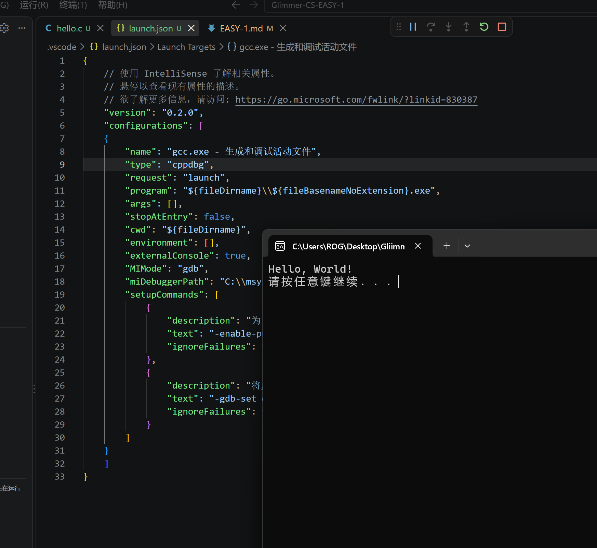
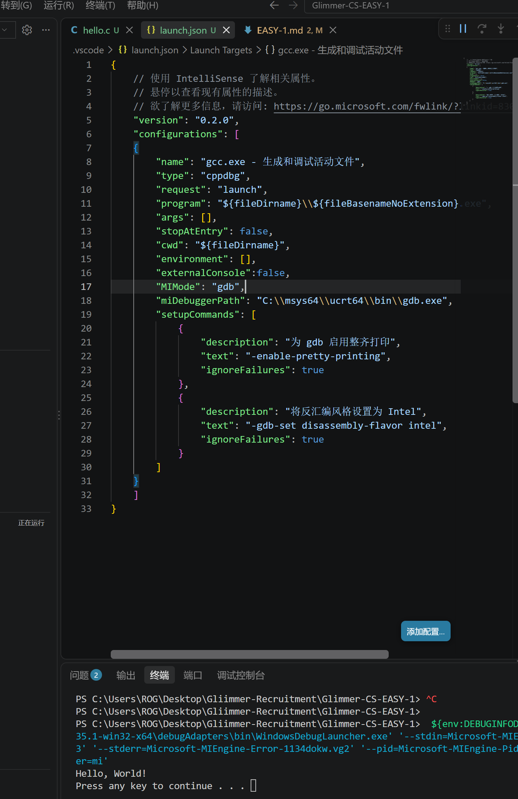
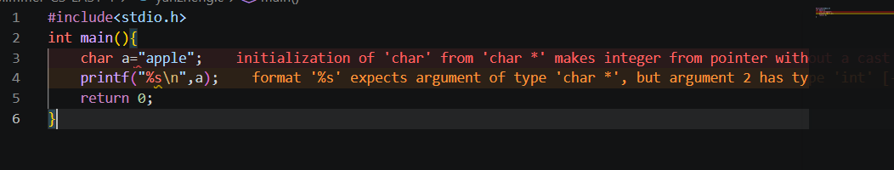
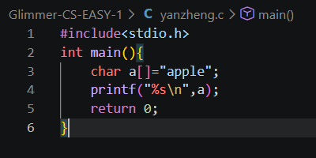

# EASY-1 C语言入门

>## part1_了解C语言配置文件

### 1.GCC和MinGW

- ***GCC***:一种编译器,GNU工具,能将人写出的程序经过预处理,编译,汇编和链接翻译成机器码(二进制);
- ***MinGW***:也是一种GNU工具,与GCC不同的是,GCC只能在Linux上运行,MinGW是它在Windows平台的移植版本.

### 2.三种.json文件

(依本人理解,VScode本体只是可以输入文本,而这三个文件负责帮助配置编程环境.)

- ***c_cpp_properties.json***:C/C++配置.指定了编译器路径和包含路径;
- ***launch.json***:调试配置.用于配置调试器(常见的有GDB等).可以决定使用的终端是外置还是内置,所以成为最常更改的一个;
- ***task.json***:任务配置.用于定义编译任务.它将GCC集成到VScode中,实现了代码到程序的编译.

### 3.插件的作用

VScode原生只提供文本编辑功能,依据网上的资料,安装C语言插件可以引入LSP)            也就是使VScode可以理解C语言

如此多的插件,使VScode由本质记事本变成编程语言的强大集成开发环境(IDE).

### 4.launch.json文件的更改与hello world

>## part2_C语言基础

### 1.变量类型

- ***变量的类型***:变量的类型决定了其在存储空间内占用的大小,存储格式和允许的运算.比如存放年龄18时用到int(整型),因为年龄是整数.
存放"apple"时不应使用char类型,以下是编程验证:

- 报错原因是,char只能保存一个字符,而apple是一个单词,因此必须用字符数组char[]:

### 2.数组的起始与边界

- 数组第一个元素从0开始;
- ***数组越界***:访问arr[5]或arr[-1],即访问了未分配的内存区域,是未定义行为;
- ***危险***:访问的未定义区域存放的数据未知,若导致操作系统的数据损坏,可能使程序立即崩溃;即使未崩溃,数据也被更改,会给未来留下隐蔽bug.

### 3.流程控制 - 循环结构
