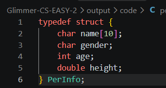
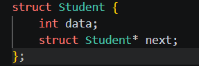

# C-EASY-2:指针

## step1.指针与结构体

### 指针

- ***定义***:数据类型 ✳指针变量名,如int ✳p;
查阅资料知,指针变量的大小是固定的,只与操作系统的内存地址总线宽度有关,64位系统中占8字节,32位4字节;

- ***代码的输出结果***:20 10
**原因**:

>1.p指针指向x,执行*p=20,x也被修改为20;
>2.在++✳arr中,'++'和'✳'优先级一致,先✳后++,即先取出arr[0]的值3,再+1,最终结果为4;
>3.在✳++q中,先++后✳.q原本指向arr[0],++使指针向前一格变为arr[1],✳将q指向的值取出,为6;
>4.4+6=10.

- ***野指针***:上一道题提到,当指针指向不可用内存地址时,我们叫它野指针.访问野指针指向的内存,可能导致操作系统强行终止程序,或正常数据被篡改,引起难以排查的隐蔽bug.
避免方法有:

>1.定义指针时初始化:int ✳p=NULL;
>2.使用free()释放动态内存后及时置空为NULL;
>3.解引用指针前,判断是否为NULL;

- ***真正有效的swap()函数***:上一道题给出函数的错误原因是没有指向主函数里a和b的内存,通过解引用,可以达成真正的交换:

>void swap(int ✳a,int ✳b){
> int temp = ✳a;
> ✳a = ✳b;
> ✳b = temp;
>}

### 结构体

- ***定义***:查阅了perinfo的用法,利用typedef取名就为PerInfo.

- ***结构体指针***:一个指向结构体变量的指针,其存储结构体变量在内存中的首地址.

- ***计算大小***:结果为24字节.

>1.char name[10]占用10字节;
>2.char gender偏移量需为1的倍数,占用第十字节;
>3.int age偏移量需为4的倍数,11填充空白,占用12到15;
>4.int height从16占用8个到23,该结构体总共占用24个字节.

## step2.链操作

### 链表

- ***链表与数组***:数组在内存中必须是连续的,大小从一开始就固定;链表的存储不需要连续,凭借指针找到下一个,大小是动态的.只有数组支持随机访问.

- **单向链表***:由数据域和指针域组成,前者存储数据,后者指向下一个节点的内存地址.定义如下:

### 链操作

- 提交在"code"文件夹中.
