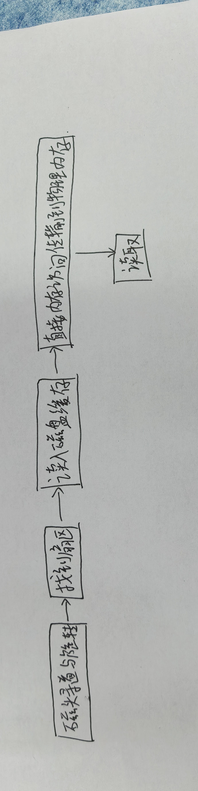

# Medium-4:计算机系统内存与执行机制

## 阶段一:硬件

### 任务1.1

- ***CPU***是中央处理器,计算机的运算与控制核心,负责逻辑判断和算术运算;
***GPU***是图形处理器,核心数量多,适合大规模并行计算;
主板是承接连接CPU,内存,硬盘,显卡等配件的平台,提供总线和供电;

- 手机宣传的512G内存实际上是存储空间,电脑的16G是运行内存DRAM.
内存包括主存RAM,寄存器和高速缓存,存储相当于硬盘或闪存;

- ***电源***要注意的是:额定功率大于整机峰值功耗,接口类型是否满足硬件供电需求,以及转换效率;

- i7不一定比i5强,还与代数,核心数,频率,后缀有关;
显卡看代数和定位,40系整体强于30系,但30系高端可能强于40系低端;

- ***老板的坑***:
  - 处理器只说i7>i5,其余没有提及,可能是淘汰的;
  - 大牌主板含糊不清;
  - 高端内存没说DDR几和频率;
  - 硬盘1.25T容量非标,可能是杂牌;
  - 整机价格低,可能全为二手硬件;

### 任务1.2

- ***常见储存介质***

  - **SRAM**:极快,功耗高,无需刷新,应用在CPU缓存中.缓解CPU与内存之间的速度差距，减少CPU访问慢速内存的等待时间;
  - **DRAM**:较快,集成度高,需要周期性刷新,断电丢失,应用在主存中.作为程序运行时的临时存储空间，存放正在执行的程序和数据，容量较大且成本可控，支撑多任务运行;
  - **NADN Flash**:断电不丢,读写速度介于DRAM和HDD之间、有擦写寿命限制、抗震,应用在SSD和存储中.可以长期保存数据和操作系统，提供比机械硬盘更快的读写速度，提升系统启动和程序加载效率;
  - **HDD**:非易失、容量大、单位成本低、读写速度慢、有机械寻道延迟、怕震动,应用在机械硬盘中.用于大容量冷数据存储、备份和归档，以低成本提供海量存储空间，适合不频繁访问的数据.
- ***寄存器,高速缓存,只读存储器***:
  - **寄存器**:位于CPU内部,速度最快,容量极小;
  - **高速缓存（Cache）**:位于CPU内部或紧邻CPU,分L1/L2/L3,速度仅次于寄存器;
  - **只读存储器（ROM）**:位于主板上,存放BIOS等固件,断电不丢失.
- ***DRAM的结构与工作原理***: DRAM每个存储单元由一个晶体管和一个电容组成,电容充放电表示1和0.电容会漏电,所以必须每隔几毫秒刷新一次，否则数据丢失.
- ***Cache的根本原理***: 基于时间局部性和空间局部性把常用数据提前放入高速小容量的Cache中,减少CPU访问慢速内存的次数.
- ***优化方案***:矩阵乘法优化方案不唯一,可以采用分块乘法,把矩阵切分为数个小块运算,充分利用Cache,减少访问主存.

## 阶段二:MMU与页表机制

### 任务2.1

- ***虚拟地址***:虚拟地址空间是操作系统为每个进程提供的独立,连续的地址空间.程序访问内存时使用的是虚拟地址,而不是真实的物理地址.好处有:
  - 一个进程无法直接访问另一个进程的内存,提高安全性;
  - 程序可以使用比实际物理内存更大的地址空间,操作系统负责将虚拟地址映射到物理内存或磁盘;

- 回答问题:
  - 每个进程的虚拟地址空间独立互不干扰.大小是4GB.
  - 基本单位是页(Page),通常为4KB.
  - 地址从低到高:代码段,数据段,BSS段,堆,文件映射以及匿名映射区,栈.
  - 页是虚拟地址空间被划分成的固定大小块,用来划分进程的逻辑地址空间.页框是物理内存被划分成的固定大小块,它属于实际的RAM,用来划分实际的物理内存.
  - 共同点:大小相同,地址空间都固定,都有编号,是分页管理的基本单位,页内偏移不变.

### 任务2.2

1.**回答问题**.
(1) ***页表***:操作系统维护的数据结构,用于存储虚拟页到物理页帧的映射关系.页是虚拟地址空间划分的基本单位,而页表起到索引作用.
(2) ***MMU***是硬件模块,将CPU发出的虚拟地址实时翻译成物理地址;***TLB***是MMU内部的高速缓存,存放最近的页表使用项,加速了地址的翻译过程.
(3) 页表存储在物理内存中.特定寄存器:在x86架构中是CR3.
(4) ***二级页表***:一种将虚拟地址映射到物理地址的分层数据结构,将大页表拆分成页目录和页表两级.单级页表需要为整个4GB虚拟地址空间分配连续的页表项,需要高达4MB的连续内存,但二级页表将页表分成多级,顶级页表只覆盖实际使用的区域,极大节省了物理内存.
(5) ***32位内存地址划分***:

- 高10位(页目录索引),用于在一级页表中查找对应的页表项.
- 中间10位(页表索引),用于在二级页表中查找对应的物理页帧号.
- 低12位(页内偏移),用于定位具体字节偏移量.

2.补全代码:

- 因为是跳做,目前仍没有能力解决,决定暂时放弃

### 任务2.3

(1) ***寄存器***:

- **CR3:**
存放一级页表的物理地址,是MMU进行地址翻译的起点;
- **CR2:**
发生缺页异常时,自动保存触发异常的虚拟地址;
- **CR0:**
决定是否开启分页机制的标志位;
- **TLB:**
MMU内部的一个高速缓存,缓存最近使用的页表项,加速地址翻译;

(2) ***流程图:***

- 1.从内存中读取:

- 2.从存储中读取:

(3) ***缺页异常:***
CPU访问的虚拟地址对应的页表项存在位为0或不在物理内存中,引起的硬件中断.

***种类与处理:***  

- **硬缺页:** 数据在磁盘中.操作系统负责将数据从磁盘读入物理内存,更新页表,然后让CPU重新执行引发异常的指令;
  
- **软缺页:** 数据已在内存中,页表映射未建立.操作系统直接分配物理页并建立映射;

- **非法访问:** 访问量无权限或非法的地址.操作系统会向进程发送SIGSEGV信号终止进程.

(4) ***页面替换:*** 当物理内存空间不足时,操作系统需要将内存中某些暂时不用的页面交换到磁盘,以留出空物理页帧给新页面使用.

- **进行:** 操作系统依据页面置换算法,挑选出一个牺牲页。如果该页被修改过,必须先写回磁盘,然后修改页表,标记该页不存在.
- **寻找替换页:** 淘汰最早进入内存的页,淘汰最长时间未被访问的页,淘汰访问率为0的页

### 思考题:64位系统与32位系统的区别

- ***虚拟地址空间大小:*** 32位为2^32字节即4GB,64位为2^64字节即256TB;
- ***页表层级:*** 32为系统通常采用二级页表,64位通常为四级或五级;
- ***虚拟地址划分:*** 32位划分10-10-12位,64位划分为9-9-9-9-12位;
- ***PTE大小:*** 32位通常4字节,64位通常8字节;
- ***物理内存支持:*** 32位通常支持4GB物理内存,64位支持TB级别内存;
- ***寄存器指向:*** 32位CR3寄存器指向页目录的物理基地址,64位的指向第四级页表的物理基地址;
- ***地址空间布局:*** 32位将4GB划分为3GB用户空间和1GB内核空间,64位的用户空间和内核空间分别占据高低部分,中间空间极大.

## 阶段三:调用栈与控制流挟持

(1) ***栈*** 的增长方向是从高地址向低地址方向生长;

(2) ***栈帧:*** 栈帧是函数调用时在栈上开辟的一块内存空间,用于存放该函数的局部变量,参数,返回地址以及保存的寄存器值.它是函数执行的工作台,保障了函数的局部变量不会互相干扰;当函数执行完毕后,栈帧被销毁,内存得以回收.

(3) ***核心寄存器的作用:*** 

- **EBP/RBP:** 指向当前栈帧的底部,在函数执行期间保持不变,用来作为偏移量的参考点,方便定位局部变量和参数.
- **ESP/RSP:** 始终指向当前栈帧的顶部.随着数据的入栈和出栈,ESP/RSP的值会动态变化.

(4) ***在函数调用的那一瞬间，程序是如何记住“执行完这个函数后，该回到哪里继续执行”的？这个信息（Return Address 返回地址）在栈帧中具体存放在什么位置?***

- 程序将"返回地址"压入栈中,通常位于当前栈帧的地步,EBP/RBP寄存器指向位置的上方.执行结束后,CPU读取这个返回地址跳回到原调用点.
